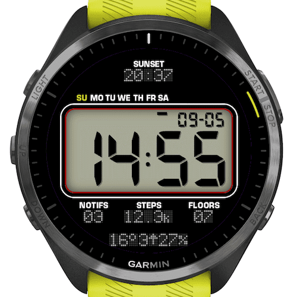
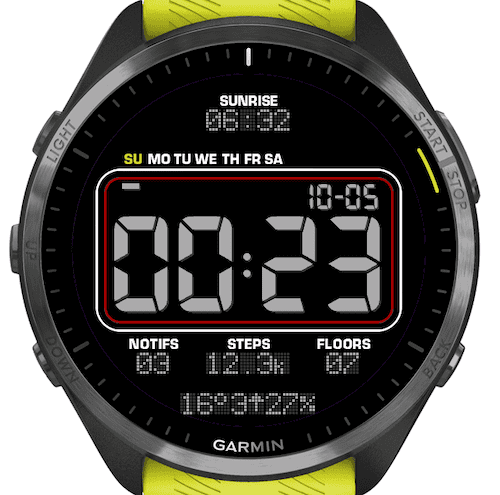

# CasWatchFace

A retro LCD-style Garmin watch face inspired by classic digital watches.

| Light | Dark |
|:---:|:---:|
|  |  |

## Features

- **Large LED time display** — HH:MM in a 7-segment font
- **Day-of-week strip** — cursor jumps to the current day (SU–SA)
- **Date** — DD-MM in the top-right corner
- **Weather row** — temperature, wind speed + direction arrow, precipitation chance
- **Sun events / alt timezone** — top area shows the next upcoming sunrise or sunset time; can be replaced with a second time zone clock
- **Activity metrics** — notifications, steps, and floors climbed
- **Battery warning** — red indicator appears when battery drops to 5% or below
- **Light/Dark/Auto theme** — auto switches between light (day) and dark (night) backgrounds based on sunrise/sunset; can be overridden in settings

## Settings

| Setting | Options | Default |
|---|---|---|
| Color Theme | Auto / Light / Dark | Auto |
| Alternative Timezone | UTC−12:00 … UTC+14:00 / None | None |

## Devices

- Garmin Forerunner 965
- Garmin Forerunner 265

Requires Connect IQ 5.2.0+
